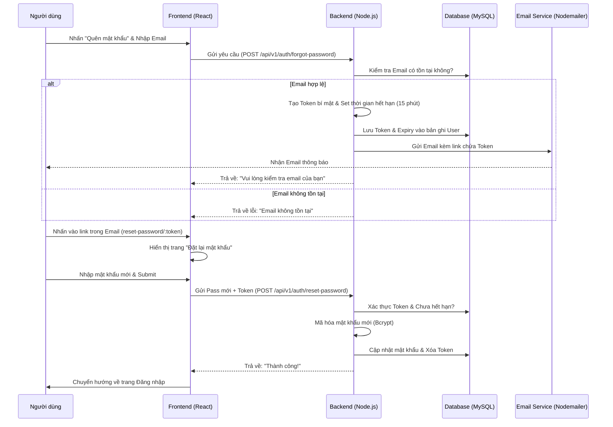

# Kế hoạch triển khai tính năng Quên mật khẩu qua Email

Tài liệu này mô tả luồng xử lý và các bước thực hiện tính năng Quên mật khẩu (Forgot Password) cho dự án PhongTro123 bằng phương thức xác thực Email.

## 1. Luồng xử lý (Workflow)

## 2. Các thành phần cần triển khai

### A. Database (Model User)
Cần bổ sung 2 trường mới vào bảng `Users`:
- `passwordResetToken`: (String) Lưu mã hash của token.
- `passwordResetExpires`: (Date) Thời gian hết hạn của mã.

### B. Backend (Node.js)
1. **Cài đặt thư viện:** `npm install nodemailer`
2. **Cấu hình Email:** Sử dụng dịch vụ Gmail (App Password).
3. **Controller Auth:**
   - Hàm `forgotPassword`: Kiểm tra email, tạo mã, lưu DB và gửi mail.
   - Hàm `resetPassword`: Kiểm tra mã từ URL, cập nhật mật khẩu mới.

### C. Frontend (React)
1. **Trang Quên mật khẩu:**
   - Form nhập Email.
   - Thông báo hướng dẫn người dùng check mail.
2. **Trang Đặt lại mật khẩu:**
   - Form nhập `New Password` và `Confirm Password`.
   - Tính năng ẩn/hiện mật khẩu để tránh sai sót.

## 3. Lý do lựa chọn phương án này
- **Chi phí:** Hoàn toàn miễn phí (không tốn tiền mua API SMS).
- **Tính chuyên nghiệp:** Đây là tiêu chuẩn bảo mật của các hệ thống hiện đại.
- **Dễ Demo:** Thầy cô có thể thấy email gửi về thật sự trong quá trình bảo vệ đồ án.

---
