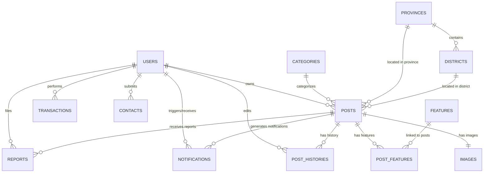

# 3.4. Chi tiết các bảng lưu trữ dữ liệu

Cơ sở dữ liệu của hệ thống TroTLU1988 được thiết kế theo hướng tối ưu hóa truy vấn và hiệu năng hoạt động. Trên thực tế, hệ thống có **14 bảng vật lý** được lưu trữ trong MySQL.

Một số thực thể logic trước đây như **Overview** (Tổng quan tin đăng) và **Attribute** (Thuộc tính tin đăng) đã được **tích hợp trực tiếp (gộp cột)** vào bảng `Posts` nhằm giảm thiểu số lượng phép JOIN phức tạp khi truy vấn danh sách tin đăng, cải thiện đáng kể tốc độ phản hồi API.
Các cấu hình khoảng giá tìm kiếm (**Price**) và khoảng diện tích (**Area**) được quản lý trực tiếp dưới dạng cấu hình tĩnh trong mã nguồn ứng dụng (static configuration) thay vì tạo bảng trong cơ sở dữ liệu để tránh truy vấn dư thừa.
Bảng **Package** được thiết lập để quản lý động các gói tin đăng dịch vụ VIP và tin thường.

Dưới đây là cấu trúc chi tiết của 14 bảng vật lý trong cơ sở dữ liệu của hệ thống TroTLU1988.

---

### 3.4.1. Bảng User (Người dùng) - Bảng `Users`

Bảng này lưu trữ thông tin tài khoản của người dùng, chủ trọ, quản trị viên và các tài liệu để xác thực danh tính KYC.

| STT | Tên cột              | Kiểu dữ liệu | Mô tả                                                             |
| :-- | :------------------- | :----------- | :---------------------------------------------------------------- |
| 1   | id                   | VARCHAR(255) | Mã định danh người dùng (Khóa chính)                              |
| 2   | name                 | VARCHAR(255) | Họ và tên người dùng                                              |
| 3   | password             | VARCHAR(255) | Mật khẩu (đã mã hóa)                                              |
| 4   | phone                | VARCHAR(255) | Số điện thoại                                                     |
| 5   | role                 | VARCHAR(255) | Vai trò hệ thống (admin/user)                                     |
| 6   | zalo                 | VARCHAR(255) | Số điện thoại Zalo                                                |
| 7   | email                | VARCHAR(255) | Địa chỉ email                                                     |
| 8   | avatar               | VARCHAR(255) | Ảnh đại diện                                                      |
| 9   | balance              | BIGINT       | Số dư tài khoản (VND)                                             |
| 10  | otp                  | VARCHAR(255) | Mã xác thực OTP khôi phục mật khẩu                                |
| 11  | passwordResetExpires | DATETIME     | Thời gian hết hạn của OTP                                         |
| 12  | status               | VARCHAR(255) | Trạng thái tài khoản (active/blocked)                             |
| 13  | cccdNumber           | VARCHAR(255) | Số định danh cá nhân / CCCD (12 chữ số)                           |
| 14  | cccdFront            | VARCHAR(255) | Ảnh mặt trước CCCD (URL Cloudinary)                               |
| 15  | cccdBack             | VARCHAR(255) | Ảnh mặt sau CCCD (URL Cloudinary)                                 |
| 16  | kycStatus            | VARCHAR(255) | Trạng thái xác minh KYC (unverified, pending, rejected, verified) |
| 17  | kycNote              | VARCHAR(255) | Ghi chú lý do từ chối KYC từ Admin                                |
| 18  | createdAt            | DATETIME     | Thời gian tạo tài khoản                                           |
| 19  | updatedAt            | DATETIME     | Thời gian cập nhật tài khoản                                      |

---

### 3.4.2. Bảng Post (Tin đăng) - Bảng `Posts`

Bảng này lưu trữ thông tin chính của các bài đăng cho thuê, bao gồm thông tin chi tiết về liên kết vùng miền, thuộc tính hiển thị (gộp từ Attribute cũ) và cấu hình tin đăng (gộp từ Overview cũ).

| STT | Tên cột      | Kiểu dữ liệu | Mô tả                                                 |
| :-- | :----------- | :----------- | :---------------------------------------------------- |
| 1   | id           | VARCHAR(255) | Mã định danh bài đăng (Khóa chính)                    |
| 2   | title        | VARCHAR(255) | Tiêu đề bài đăng                                      |
| 3   | star         | INTEGER      | Đánh giá sao tương ứng loại VIP (0-5, mặc định 0)     |
| 4   | address      | VARCHAR(255) | Địa chỉ chi tiết phòng trọ                            |
| 5   | description  | TEXT         | Nội dung mô tả chi tiết                               |
| 6   | categoryCode | VARCHAR(255) | Mã danh mục liên kết (Khóa ngoại)                     |
| 7   | provinceCode | VARCHAR(255) | Mã tỉnh/thành phố liên kết (Khóa ngoại)               |
| 8   | districtCode | VARCHAR(255) | Mã quận/huyện liên kết (Khóa ngoại)                   |
| 9   | priceCode    | VARCHAR(255) | Mã khoảng giá phục vụ bộ lọc tìm kiếm                 |
| 10  | areaCode     | VARCHAR(255) | Mã diện tích phục vụ bộ lọc tìm kiếm                  |
| 11  | priceNumber  | FLOAT        | Giá trị số của giá thuê (triệu/tháng)                 |
| 12  | areaNumber   | FLOAT        | Giá trị số của diện tích (m2)                         |
| 13  | status       | VARCHAR(255) | Trạng thái tin đăng (pending/active/expired)          |
| 14  | userId       | VARCHAR(255) | Mã người đăng bài (Khóa ngoại)                        |
| 15  | note         | TEXT         | Ghi chú lý do từ chối duyệt bài từ Admin              |
| 16  | price        | VARC         | Chuỗi văn bản hiển thị giá (ví dụ: "3.5 triệu/tháng") |
| 17  | acreage      | VARCHAR(255) | Chuỗi văn bản hiển thị diện tích (ví dụ: "25 m²")     |
| 18  | overviewCode | VARCHAR(255) | Mã tin hiển thị cho khách hàng (ví dụ: `#123456`)     |
| 19  | type         | VARCHAR(255) | Loại chuyên mục hiển thị của tin                      |
| 20  | target       | VARCHAR(255) | Đối tượng cho thuê mục tiêu (Tất cả/Nam/Nữ)           |
| 21  | bonus        | VARCHAR(255) | Tên gói VIP dịch vụ cộng thêm                         |
| 22  | published    | VARCHAR(255) | Thời gian đăng tin dạng chuỗi                         |
| 23  | expired      | VARCHAR(255) | Thời gian hết hạn tin dạng chuỗi                      |
| 24  | createdAt    | DATETIME     | Thời gian tạo tin                                     |
| 25  | updatedAt    | DATETIME     | Thời gian cập nhật tin                                |

---

### 3.4.3. Bảng Image (Hình ảnh) - Bảng `Images`

Bảng lưu trữ danh sách URL các hình ảnh thực tế đính kèm của bài đăng.

| STT | Tên cột   | Kiểu dữ liệu | Mô tả                                           |
| :-- | :-------- | :----------- | :---------------------------------------------- |
| 1   | id        | VARCHAR(255) | Mã định danh hình ảnh (Khóa chính)              |
| 2   | postId    | VARCHAR(255) | Mã bài đăng liên kết (Khóa ngoại)               |
| 3   | image     | TEXT         | Chuỗi JSON chứa danh sách các link ảnh đính kèm |
| 4   | createdAt | DATETIME     | Thời gian tạo bản ghi                           |
| 5   | updatedAt | DATETIME     | Thời gian cập nhật bản ghi                      |

---

### 3.4.4. Bảng Category (Danh mục) - Bảng `Categories`

Bảng lưu trữ các danh mục loại hình phòng trọ cho thuê.

| STT | Tên cột     | Kiểu dữ liệu | Mô tả                                               |
| :-- | :---------- | :----------- | :-------------------------------------------------- |
| 1   | id          | VARCHAR(255) | Mã định danh danh mục (Khóa chính)                  |
| 2   | code        | VARCHAR(255) | Mã danh mục chuẩn hóa (Unique)                      |
| 3   | value       | VARCHAR(255) | Tên danh mục (Phòng trọ, Căn hộ, Nhà nguyên căn...) |
| 4   | header      | VARCHAR(255) | Tiêu đề lớn hiển thị trên trang                     |
| 5   | description | VARCHAR(255) | Mô tả chi tiết danh mục                             |
| 6   | order       | INTEGER      | Thứ tự sắp xếp hiển thị danh mục                    |
| 7   | createdAt   | DATETIME     | Thời gian tạo bản ghi                               |
| 8   | updatedAt   | DATETIME     | Thời gian cập nhật bản ghi                          |

---

### 3.4.5. Bảng Feature (Tiện ích) - Bảng `Features`

Bảng lưu các tiện ích có thể đính kèm của một căn phòng (như Wifi, Nóng lạnh, Điều hòa...).

| STT | Tên cột   | Kiểu dữ liệu | Mô tả                                       |
| :-- | :-------- | :----------- | :------------------------------------------ |
| 1   | id        | VARCHAR(255) | Mã định danh tiện ích (Khóa chính)          |
| 2   | code      | VARCHAR(255) | Mã tiện ích chuẩn hóa (Unique)              |
| 3   | value     | VARCHAR(255) | Tên tiện ích (ví dụ: "Có Wifi", "Điều hòa") |
| 4   | createdAt | DATETIME     | Thời gian tạo bản ghi                       |
| 5   | updatedAt | DATETIME     | Thời gian cập nhật bản ghi                  |

---

### 3.4.6. Bảng PostFeature (Tiện ích bài đăng) - Bảng `PostFeatures`

Bảng trung gian quản lý mối quan hệ nhiều-nhiều giữa bài viết (`Post`) và tiện ích (`Feature`).

| STT | Tên cột   | Kiểu dữ liệu | Mô tả                                        |
| :-- | :-------- | :----------- | :------------------------------------------- |
| 1   | id        | VARCHAR(255) | Mã định danh bản ghi trung gian (Khóa chính) |
| 2   | postId    | VARCHAR(255) | Mã bài viết liên kết (Khóa ngoại)            |
| 3   | featureId | VARCHAR(255) | Mã tiện ích liên kết (Khóa ngoại)            |
| 4   | createdAt | DATETIME     | Thời gian tạo bản ghi                        |
| 5   | updatedAt | DATETIME     | Thời gian cập nhật bản ghi                   |

---

### 3.4.7. Bảng Province (Tỉnh thành) - Bảng `Provinces`

Bảng lưu trữ thông tin tỉnh/thành phố phục vụ bộ lọc khu vực địa lý.

| STT | Tên cột   | Kiểu dữ liệu | Mô tả                                  |
| :-- | :-------- | :----------- | :------------------------------------- |
| 1   | id        | VARCHAR(255) | Mã định danh tỉnh thành (Khóa chính)   |
| 2   | code      | VARCHAR(255) | Mã tỉnh thành chuẩn hóa (Unique)       |
| 3   | value     | VARCHAR(255) | Tên tỉnh/thành phố (Hà Nội, TP.HCM...) |
| 4   | createdAt | DATETIME     | Thời gian tạo bản ghi                  |
| 5   | updatedAt | DATETIME     | Thời gian cập nhật bản ghi             |

---

### 3.4.8. Bảng District (Quận huyện) - Bảng `Districts`

Bảng lưu trữ các quận/huyện trực thuộc tỉnh/thành phố tương ứng.

| STT | Tên cột      | Kiểu dữ liệu | Mô tả                                             |
| :-- | :----------- | :----------- | :------------------------------------------------ |
| 1   | id           | VARCHAR(255) | Mã định danh quận huyện (Khóa chính)              |
| 2   | code         | VARCHAR(255) | Mã quận huyện chuẩn hóa (Unique)                  |
| 3   | value        | VARCHAR(255) | Tên quận huyện (Quận Đống Đa, Huyện Thanh Trì...) |
| 4   | provinceCode | VARCHAR(255) | Mã tỉnh thành chủ quản liên kết (Khóa ngoại)      |
| 5   | createdAt    | DATETIME     | Thời gian tạo bản ghi                             |
| 6   | updatedAt    | DATETIME     | Thời gian cập nhật bản ghi                        |

---

### 3.4.9. Bảng Transaction (Giao dịch) - Bảng `Transactions`

Bảng lưu trữ nhật ký biến động số dư và các giao dịch thanh toán tin đăng VIP của người dùng.

| STT | Tên cột   | Kiểu dữ liệu | Mô tả                                          |
| :-- | :-------- | :----------- | :--------------------------------------------- |
| 1   | id        | VARCHAR(255) | Mã định danh giao dịch (Khóa chính)            |
| 2   | userId    | VARCHAR(255) | Mã người thực hiện giao dịch (Khóa ngoại)      |
| 3   | amount    | INTEGER      | Số tiền giao dịch (VND)                        |
| 4   | type      | VARCHAR(255) | Loại giao dịch (Nạp tiền / Thanh toán gói VIP) |
| 5   | content   | VARCHAR(255) | Nội dung diễn giải giao dịch                   |
| 6   | status    | VARCHAR(255) | Trạng thái (success, pending, cancel)          |
| 7   | createdAt | DATETIME     | Thời gian thực hiện giao dịch                  |
| 8   | updatedAt | DATETIME     | Thời gian cập nhật trạng thái                  |

---

### 3.4.10. Bảng Package (Gói dịch vụ) - Bảng `Packages`

Bảng lưu cấu hình giá cả, màu sắc giao diện và các đặc quyền của các gói tin đăng (VIP Nổi bật, VIP 1, VIP 2, VIP 3, Tin thường).

| STT | Tên cột   | Kiểu dữ liệu | Mô tả                                                  |
| :-- | :-------- | :----------- | :----------------------------------------------------- |
| 1   | id        | VARCHAR(255) | Mã định danh gói VIP (v5, v4, v3, v2, v0) (Khóa chính) |
| 2   | name      | VARCHAR(255) | Tên gói tin đăng                                       |
| 3   | star      | INTEGER      | Số sao hiển thị tương ứng (0 - 5)                      |
| 4   | price     | INTEGER      | Giá đăng tin theo ngày (VND)                           |
| 5   | color     | VARCHAR(255) | Class màu sắc hiển thị trên UI (ví dụ: `text-red-600`) |
| 6   | benefit   | TEXT         | Mô tả các lợi ích đi kèm của gói tin                   |
| 7   | createdAt | DATETIME     | Thời gian tạo bản ghi                                  |
| 8   | updatedAt | DATETIME     | Thời gian cập nhật bản ghi                             |

---

### 3.4.11. Bảng Contact (Liên hệ) - Bảng `Contacts`

Bảng lưu các yêu cầu góp ý, phản hồi của người dùng gửi đến Admin và phản hồi trả lời.

| STT | Tên cột   | Kiểu dữ liệu | Mô tả                                                        |
| :-- | :-------- | :----------- | :----------------------------------------------------------- |
| 1   | id        | INTEGER      | Mã định danh liên hệ (Khóa chính tự tăng)                    |
| 2   | userId    | VARCHAR(255) | Mã người gửi liên hệ nếu đã đăng nhập (Khóa ngoại, Nullable) |
| 3   | name      | VARCHAR(255) | Họ tên người gửi phản hồi                                    |
| 4   | phone     | VARCHAR(255) | Số điện thoại liên hệ                                        |
| 5   | content   | TEXT         | Nội dung liên hệ chi tiết                                    |
| 6   | response  | TEXT         | Nội dung phản hồi, xử lý của Admin                           |
| 7   | status    | VARCHAR(255) | Trạng thái liên hệ (pending, processed)                      |
| 8   | createdAt | DATETIME     | Thời gian gửi liên hệ                                        |
| 9   | updatedAt | DATETIME     | Thời gian cập nhật xử lý                                     |

---

### 3.4.12. Bảng PostHistory (Lịch sử chỉnh sửa tin đăng) - Bảng `PostHistories`

Bảng lưu trữ thông tin đối chiếu dữ liệu trước và sau mỗi lần chỉnh sửa bài đăng bởi chủ trọ hoặc admin.

| STT | Tên cột        | Kiểu dữ liệu | Mô tả                                        |
| :-- | :------------- | :----------- | :------------------------------------------- |
| 1   | id             | VARCHAR(255) | Mã lịch sử sửa đổi (UUID, Khóa chính)        |
| 2   | postId         | VARCHAR(255) | Mã bài đăng được sửa đổi (Khóa ngoại)        |
| 3   | editorId       | VARCHAR(255) | Mã tài khoản thực hiện biên tập (Khóa ngoại) |
| 4   | oldTitle       | VARCHAR(255) | Tiêu đề cũ của bài đăng                      |
| 5   | newTitle       | VARCHAR(255) | Tiêu đề mới của bài đăng                     |
| 6   | oldPrice       | DOUBLE       | Giá cũ (triệu/tháng)                         |
| 7   | newPrice       | DOUBLE       | Giá mới (triệu/tháng)                        |
| 8   | oldArea        | DOUBLE       | Diện tích cũ (m2)                            |
| 9   | newArea        | DOUBLE       | Diện tích mới (m2)                           |
| 10  | oldDescription | TEXT         | Mô tả cũ                                     |
| 11  | newDescription | TEXT         | Mô tả mới                                    |
| 12  | oldAddress     | TEXT         | Địa chỉ cũ                                   |
| 13  | newAddress     | TEXT         | Địa chỉ mới                                  |
| 14  | createdAt      | DATETIME     | Thời điểm sửa đổi                            |
| 15  | updatedAt      | DATETIME     | Thời điểm cập nhật lịch sử                   |

---

### 3.4.13. Bảng Notification (Thông báo hệ thống) - Bảng `Notifications`

Bảng lưu trữ các thông báo gửi đến người dùng cụ thể hoặc toàn bộ quản trị viên khi có các sự kiện phát sinh.

| STT | Tên cột     | Kiểu dữ liệu | Mô tả                                                             |
| :-- | :---------- | :----------- | :---------------------------------------------------------------- |
| 1   | id          | VARCHAR(255) | Mã thông báo (UUID, Khóa chính)                                   |
| 2   | postId      | VARCHAR(255) | Mã tin đăng liên quan (Nullable)                                  |
| 3   | senderId    | VARCHAR(255) | Mã người kích hoạt sự kiện (Nullable)                             |
| 4   | recipientId | VARCHAR(255) | Mã người nhận thông báo (Nullable, Null là gửi cho toàn bộ Admin) |
| 5   | title       | VARCHAR(255) | Tiêu đề thông báo                                                 |
| 6   | content     | TEXT         | Chi tiết thông báo                                                |
| 7   | isRead      | BOOLEAN      | Trạng thái đã xem (mặc định false)                                |
| 8   | createdAt   | DATETIME     | Thời điểm thông báo phát sinh                                     |
| 9   | updatedAt   | DATETIME     | Thời điểm cập nhật trạng thái                                     |

---

### 3.4.14. Bảng Report (Báo cáo vi phạm) - Bảng `Reports`

Bảng lưu trữ khiếu nại của người dùng thuê trọ về tin đăng lừa đảo hoặc thông tin sai lệch.

| STT | Tên cột   | Kiểu dữ liệu | Mô tả                                                   |
| :-- | :-------- | :----------- | :------------------------------------------------------ |
| 1   | id        | VARCHAR(255) | Mã báo cáo vi phạm (UUID, Khóa chính)                   |
| 2   | postId    | VARCHAR(255) | Mã tin đăng bị báo cáo (Khóa ngoại)                     |
| 3   | userId    | VARCHAR(255) | Mã người gửi báo cáo (Khóa ngoại, Nullable nếu ẩn danh) |
| 4   | reason    | VARCHAR(255) | Danh mục lý do báo cáo vi phạm                          |
| 5   | content   | TEXT         | Ý kiến phản ánh chi tiết từ khách hàng                  |
| 6   | status    | VARCHAR(255) | Trạng thái xử lý (pending, resolved, rejected)          |
| 7   | createdAt | DATETIME     | Thời điểm gửi báo cáo                                   |
| 8   | updatedAt | DATETIME     | Thời điểm cập nhật trạng thái báo cáo                   |

---

## 3.5. Mối quan hệ giữa các thực thể trong cơ sở dữ liệu

Dưới đây là sơ đồ thực thể mối quan hệ (ERD) hoàn chỉnh thể hiện mối liên kết giữa các bảng vật lý trong hệ thống:

### Chi tiết các mối quan hệ:

1. **User - Post (1:N):**
   - Khóa ngoại `userId` trong bảng `Posts` tham chiếu tới `id` trong bảng `Users`.
   - Một người dùng (chủ trọ) có thể sở hữu nhiều bài đăng, nhưng mỗi bài đăng chỉ thuộc về một người dùng duy nhất. Khi tài khoản người dùng bị xóa, toàn bộ bài đăng liên quan sẽ tự động bị xóa theo (`CASCADE`).

2. **User - Transaction (1:N):**
   - Khóa ngoại `userId` trong bảng `Transactions` tham chiếu tới `id` trong bảng `Users`.
   - Lưu vết mọi giao dịch tài chính của người dùng (nạp tiền, trả phí dịch vụ).

3. **User - Contact (1:N):**
   - Khóa ngoại `userId` trong bảng `Contacts` tham chiếu tới `id` trong bảng `Users` (cho phép NULL đối với khách hàng vãng lai chưa có tài khoản).
   - Lưu các thắc mắc, phản ánh và câu trả lời hỗ trợ từ quản trị viên.

4. **Post - Image (1:1):**
   - Khóa ngoại `postId` trong bảng `Images` tham chiếu tới `id` trong bảng `Posts`.
   - Mỗi bài đăng sở hữu duy nhất một hàng quản lý danh sách ảnh đính kèm (dưới dạng mảng JSON lưu trong cột TEXT).

5. **Post - Feature (N:N Logic):**
   - Mối quan hệ logic Nhiều - Nhiều giữa bài đăng (`Posts`) và tiện ích (`Features`).
   - Một bài đăng có thể đính kèm nhiều tiện ích và ngược lại, một tiện ích (ví dụ: Wifi) có mặt ở nhiều bài đăng khác nhau.

6. **Post - PostFeature (1:N):**
   - Khóa ngoại `postId` trong bảng `PostFeatures` tham chiếu tới `id` của bảng `Posts` (`ON DELETE CASCADE`).
   - Ý nghĩa: Mỗi bài đăng liên kết tới nhiều dòng trong bảng trung gian `PostFeatures` để lưu trữ các tiện ích của nó.

7. **Feature - PostFeature (1:N):**
   - Khóa ngoại `featureId` trong bảng `PostFeatures` tham chiếu tới `id` của bảng `Features` (`ON DELETE CASCADE`).
   - Ý nghĩa: Mỗi tiện ích liên kết tới nhiều dòng trong bảng trung gian `PostFeatures` để biểu thị các bài viết sở hữu tiện ích đó.

8. **Province - District (1:N):**
   - Khóa ngoại `provinceCode` trong bảng `Districts` tham chiếu đến trường `code` (Unique) của bảng `Provinces` (`ON DELETE SET NULL`, `ON UPDATE CASCADE`).
   - Ý nghĩa: Một tỉnh/thành phố có nhiều quận/huyện trực thuộc.

9. **Post - Province (N:1):**
   - Khóa ngoại `provinceCode` trong bảng `Posts` tham chiếu đến trường `code` (Unique) của bảng `Provinces` (`ON DELETE SET NULL`, `ON UPDATE CASCADE`).
   - Ý nghĩa: Nhiều tin đăng có thể nằm ở cùng một tỉnh/thành phố.

10. **Post - District (N:1):**

- Khóa ngoại `districtCode` trong bảng `Posts` tham chiếu đến trường `code` (Unique) của bảng `Districts` (`ON DELETE SET NULL`, `ON UPDATE CASCADE`).
- Ý nghĩa: Nhiều tin đăng có thể nằm ở cùng một quận/huyện.

11. **Post - Package (N:1 Logic):**

- Mối liên kết logic dựa trên trường `star` (số sao của tin) hoặc `bonus` (tên gói dịch vụ) trong bảng `Posts` tương ứng với trường `star` trong bảng `Packages`.
- Ý nghĩa: Mỗi bài viết thuộc về một gói dịch vụ tin đăng xác định (VIP Nổi bật, VIP 1, VIP 2, VIP 3, Tin thường). Hệ thống sử dụng mối quan hệ này để xác định mức phí thanh toán tin đăng mỗi ngày (lấy từ bảng `Packages` khi đăng tin) và độ ưu tiên hiển thị (tin VIP nhiều sao hiển thị ở vị trí cao hơn), cũng như kiểu dáng thiết kế UI tương ứng.

12. **Post - PostHistory (1:N) & User - PostHistory (1:N):**

- Lưu lại vết dữ liệu tiêu đề, giá, diện tích, mô tả trước và sau khi chỉnh sửa bài đăng.
- `postId` liên kết tới tin đăng, và `editorId` liên kết tới tài khoản của người thực hiện sửa đổi (chủ trọ hoặc Admin).

13. **Notification Relationships:**

- Một thông báo (`Notification`) có thể liên quan đến một tin đăng (`postId`), ghi nhận người thực hiện hành động tạo thông báo (`senderId`) và người nhận thông báo (`recipientId`).
- Nếu `recipientId` nhận giá trị `NULL`, thông báo đó được gửi chung đến toàn bộ ban quản trị (Admin).

14. **Report Relationships:**

- Một tin đăng phòng trọ có thể nhận nhiều lượt báo xấu hoặc báo cáo vi phạm từ những người dùng khác nhau thông qua bảng `Reports`.
- Trường `userId` trong bảng `Reports` lưu vết người gửi báo cáo (cho phép NULL để hỗ trợ báo cáo ẩn danh).
