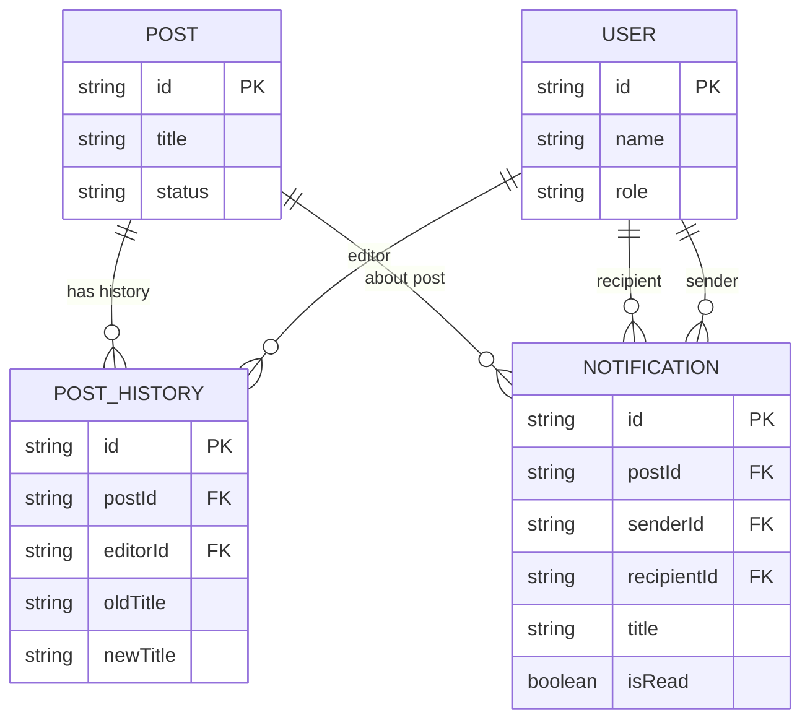

# 3.4. Chi tiết các bảng lưu trữ dữ liệu

Dưới đây là chi tiết cấu trúc các bảng trong cơ sở dữ liệu của hệ thống PhongTro123.

---

### 3.4.1. Bảng User (Người dùng)

Bảng này lưu trữ thông tin tài khoản của người dùng và quản trị viên.

| STT | Tên cột | Kiểu dữ liệu | Mô tả |
| :-- | :------ | :----------- | :---- |
| 1 | id | VARCHAR(255) | Mã định danh người dùng |
| 2 | name | VARCHAR(255) | Họ và tên người dùng |
| 3 | password | VARCHAR(255) | Mật khẩu (đã mã hóa) |
| 4 | phone | VARCHAR(255) | Số điện thoại |
| 5 | role | VARCHAR(255) | Vai trò (admin/user) |
| 6 | zalo | VARCHAR(255) | Số điện thoại Zalo |
| 7 | email | VARCHAR(255) | Địa chỉ email |
| 8 | avatar | VARCHAR(255) | Ảnh đại diện |
| 9 | balance | INT | Số dư tài khoản |
| 10 | otp | VARCHAR(255) | Mã xác thực OTP |
| 11 | passwordResetExpires | DATETIME | Thời gian hết hạn OTP |
| 12 | status | VARCHAR(255) | Trạng thái tài khoản |
| 13 | createdAt | DATETIME | Thời gian tạo |
| 14 | updatedAt | DATETIME | Thời gian cập nhật |

---

### 3.4.2. Bảng Post (Tin đăng)

Bảng này lưu trữ thông tin chính của các bài đăng cho thuê.

| STT | Tên cột | Kiểu dữ liệu | Mô tả |
| :-- | :------ | :----------- | :---- |
| 1 | id | VARCHAR(255) | Mã định danh bài đăng |
| 2 | title | VARCHAR(255) | Tiêu đề bài đăng |
| 3 | star | VARCHAR(255) | Đánh giá sao (loại VIP) |
| 4 | address | VARCHAR(255) | Địa chỉ chi tiết |
| 5 | description | TEXT | Nội dung mô tả |
| 6 | categoryCode | VARCHAR(255) | Mã danh mục |
| 7 | provinceCode | VARCHAR(255) | Mã tỉnh/thành phố |
| 8 | districtCode | VARCHAR(255) | Mã quận/huyện |
| 9 | priceCode | VARCHAR(255) | Mã khoảng giá |
| 10 | areaCode | VARCHAR(255) | Mã diện tích |
| 11 | priceNumber | FLOAT | Giá trị số của giá |
| 12 | areaNumber | FLOAT | Giá trị số của diện tích |
| 13 | status | VARCHAR(255) | Trạng thái tin đăng |
| 14 | userId | VARCHAR(255) | Mã người đăng |
| 15 | note | VARCHAR(255) | Ghi chú từ Admin (Ví dụ: Lý do từ chối tin) |
| 16 | createdAt | DATETIME | Thời gian tạo |
| 17 | updatedAt | DATETIME | Thời gian cập nhật |

---

### 3.4.3. Bảng Overview (Tổng quan)

Bảng này lưu trữ thông tin chi tiết về mã tin và thời hạn.

| STT | Tên cột | Kiểu dữ liệu | Mô tả |
| :-- | :------ | :----------- | :---- |
| 1 | id | VARCHAR(255) | Mã định danh |
| 2 | postId | VARCHAR(255) | Mã bài đăng liên kết |
| 3 | code | VARCHAR(255) | Mã tin hiển thị |
| 4 | type | VARCHAR(255) | Loại tin |
| 5 | target | VARCHAR(255) | Đối tượng hướng tới |
| 6 | bonus | VARCHAR(255) | Gói dịch vụ cộng thêm |
| 7 | published | VARCHAR(255) | Ngày đăng |
| 8 | expired | VARCHAR(255) | Ngày hết hạn |

---

### 3.4.4. Bảng Transaction (Giao dịch)

Bảng lưu trữ lịch sử nạp tiền và thanh toán của người dùng.

| STT | Tên cột | Kiểu dữ liệu | Mô tả |
| :-- | :------ | :----------- | :---- |
| 1 | id | VARCHAR(255) | Mã định danh giao dịch |
| 2 | userId | VARCHAR(255) | Mã người thực hiện |
| 3 | amount | INT | Số tiền giao dịch |
| 4 | type | VARCHAR(255) | Loại giao dịch |
| 5 | content | VARCHAR(255) | Nội dung giao dịch |
| 6 | status | VARCHAR(255) | Trạng thái giao dịch |
| 7 | createdAt | DATETIME | Thời gian giao dịch |
| 8 | updatedAt | DATETIME | Thời gian cập nhật |

---

### 3.4.5. Bảng Category (Danh mục)

| STT | Tên cột | Kiểu dữ liệu | Mô tả |
| :-- | :------ | :----------- | :---- |
| 1 | id | VARCHAR(255) | Mã định danh |
| 2 | code | VARCHAR(255) | Mã danh mục |
| 3 | value | VARCHAR(255) | Tên danh mục |
| 4 | header | VARCHAR(255) | Tiêu đề trang |
| 5 | description | VARCHAR(255) | Mô tả danh mục |
| 6 | order | INT | Thứ tự hiển thị |

---

### 3.4.6. Bảng Attribute (Thuộc tính)

| STT | Tên cột | Kiểu dữ liệu | Mô tả |
| :-- | :------ | :----------- | :---- |
| 1 | id | VARCHAR(255) | Mã định danh |
| 2 | postId | VARCHAR(255) | Mã bài đăng |
| 3 | price | VARCHAR(255) | Chuỗi hiển thị giá |
| 4 | acreage | VARCHAR(255) | Chuỗi hiển thị diện tích |
| 5 | published | VARCHAR(255) | Thời gian đăng (văn bản) |

---

### 3.4.7. Bảng Image (Hình ảnh)

| STT | Tên cột | Kiểu dữ liệu | Mô tả |
| :-- | :------ | :----------- | :---- |
| 1 | id | VARCHAR(255) | Mã định danh |
| 2 | postId | VARCHAR(255) | Mã bài đăng |
| 3 | image | TEXT | Danh sách URL ảnh (JSON) |

---

### 3.4.8. Bảng Feature (Tiện ích)

| STT | Tên cột | Kiểu dữ liệu | Mô tả |
| :-- | :------ | :----------- | :---- |
| 1 | id | VARCHAR(255) | Mã định danh |
| 2 | code | VARCHAR(255) | Mã tiện ích |
| 3 | value | VARCHAR(255) | Tên tiện ích |

---

### 3.4.9. Bảng PostFeature (Tiện ích bài đăng)

Bảng trung gian nối Post và Feature.

| STT | Tên cột | Kiểu dữ liệu | Mô tả |
| :-- | :------ | :----------- | :---- |
| 1 | id | VARCHAR(255) | Mã định danh |
| 2 | postId | VARCHAR(255) | Mã bài đăng |
| 3 | featureId | VARCHAR(255) | Mã tiện ích |

---

### 3.4.10. Bảng Province (Tỉnh thành)

| STT | Tên cột | Kiểu dữ liệu | Mô tả |
| :-- | :------ | :----------- | :---- |
| 1 | id | VARCHAR(255) | Mã định danh |
| 2 | code | VARCHAR(255) | Mã tỉnh thành |
| 3 | value | VARCHAR(255) | Tên tỉnh thành |

---

### 3.4.11. Bảng District (Quận huyện)

| STT | Tên cột | Kiểu dữ liệu | Mô tả |
| :-- | :------ | :----------- | :---- |
| 1 | id | VARCHAR(255) | Mã định danh |
| 2 | code | VARCHAR(255) | Mã quận huyện |
| 3 | value | VARCHAR(255) | Tên quận huyện |
| 4 | provinceCode | VARCHAR(255) | Mã tỉnh thành trực thuộc |

---

### 3.4.12. Bảng Price (Khoảng giá)

| STT | Tên cột | Kiểu dữ liệu | Mô tả |
| :-- | :------ | :----------- | :---- |
| 1 | id | VARCHAR(255) | Mã định danh |
| 2 | code | VARCHAR(255) | Mã khoảng giá |
| 3 | value | VARCHAR(255) | Nhãn hiển thị |
| 4 | min | FLOAT | Giá trị nhỏ nhất |
| 5 | max | FLOAT | Giá trị lớn nhất |
| 6 | order | INT | Thứ tự hiển thị |

---

### 3.4.13. Bảng Area (Khoảng diện tích)

| STT | Tên cột | Kiểu dữ liệu | Mô tả |
| :-- | :------ | :----------- | :---- |
| 1 | id | VARCHAR(255) | Mã định danh |
| 2 | code | VARCHAR(255) | Mã diện tích |
| 3 | value | VARCHAR(255) | Nhãn hiển thị |
| 4 | min | FLOAT | Giá trị nhỏ nhất |
| 5 | max | FLOAT | Giá trị lớn nhất |
| 6 | order | INT | Thứ tự hiển thị |

---

### 3.4.14. Bảng Contact (Liên hệ)

| STT | Tên cột | Kiểu dữ liệu | Mô tả |
| :-- | :------ | :----------- | :---- |
| 1 | id | INT | Mã định danh tự tăng |
| 2 | userId | VARCHAR(255) | Mã người dùng gửi liên hệ |
| 3 | name | VARCHAR(255) | Tên người gửi |
| 4 | phone | VARCHAR(255) | Số điện thoại người gửi |
| 5 | content | TEXT | Nội dung liên hệ |
| 6 | response | TEXT | Phản hồi của Admin gửi cho người dùng |
| 7 | status | VARCHAR(255) | Trạng thái xử lý |
| 8 | createdAt | DATETIME | Thời gian tạo |
| 9 | updatedAt | DATETIME | Thời gian cập nhật |

---

### 3.4.15. Bảng PostHistory (Lịch sử chỉnh sửa bài đăng)

Bảng này lưu lại dấu vết (vết sửa đổi) của tin đăng mỗi khi chủ trọ hoặc quản trị viên cập nhật thông tin chính (tiêu đề, giá cả, diện tích, mô tả, địa chỉ).

| STT | Tên cột | Kiểu dữ liệu | Mô tả |
| :-- | :------ | :----------- | :---- |
| 1 | id | VARCHAR(255) | Mã định danh lịch sử (UUID) |
| 2 | postId | VARCHAR(255) | Mã bài đăng được chỉnh sửa |
| 3 | editorId | VARCHAR(255) | Mã người thực hiện chỉnh sửa |
| 4 | oldTitle | VARCHAR(255) | Tiêu đề cũ của bài đăng |
| 5 | newTitle | VARCHAR(255) | Tiêu đề mới của bài đăng |
| 6 | oldPrice | FLOAT | Giá trị số của giá cũ |
| 7 | newPrice | FLOAT | Giá trị số của giá mới |
| 8 | oldArea | FLOAT | Giá trị số của diện tích cũ |
| 9 | newArea | FLOAT | Giá trị số của diện tích mới |
| 10 | oldDescription | TEXT | Mô tả cũ của bài đăng |
| 11 | newDescription | TEXT | Mô tả mới của bài đăng |
| 12 | oldAddress | TEXT | Địa chỉ cũ |
| 13 | newAddress | TEXT | Địa chỉ mới |
| 14 | createdAt | DATETIME | Thời gian thực hiện chỉnh sửa |
| 15 | updatedAt | DATETIME | Thời gian cập nhật |

---

### 3.4.16. Bảng Notification (Thông báo hệ thống)

Bảng này dùng để lưu trữ các thông báo hệ thống gửi đến Admin hoặc người dùng cụ thể.

| STT | Tên cột | Kiểu dữ liệu | Mô tả |
| :-- | :------ | :----------- | :---- |
| 1 | id | VARCHAR(255) | Mã định danh thông báo (UUID) |
| 2 | postId | VARCHAR(255) | Mã tin đăng liên quan (Cho phép Null) |
| 3 | senderId | VARCHAR(255) | Mã tài khoản thực hiện hành động (Cho phép Null) |
| 4 | recipientId | VARCHAR(255) | Mã tài khoản nhận thông báo (Cho phép Null) |
| 5 | title | VARCHAR(255) | Tiêu đề thông báo |
| 6 | content | VARCHAR(255) | Nội dung chi tiết thông báo |
| 7 | isRead | BOOLEAN | Trạng thái đã đọc (true) hay chưa đọc (false) |
| 8 | createdAt | DATETIME | Thời gian gửi thông báo |
| 9 | updatedAt | DATETIME | Thời gian cập nhật |

---

## 3.5. Mối quan hệ giữa các bảng mới và thực thể cũ

Để phục vụ báo cáo đồ án và vẽ sơ đồ ERD, các mối quan hệ (Relationships) của các thực thể mới bổ sung được thiết lập chặt chẽ như sau:

### 1. Thực thể Lịch sử chỉnh sửa (`PostHistory`)
* **Mối quan hệ với bài đăng (`PostHistory` -> `Post`):** 
  * Quan hệ **Nhiều - Một (N - 1)**.
  * Khóa ngoại `postId` trong bảng `PostHistory` tham chiếu đến `id` trong bảng `Post`.
  * *Ý nghĩa:* Một bài đăng (`Post`) có thể được chỉnh sửa nhiều lần (tương ứng nhiều bản ghi lịch sử `PostHistory`). Nhưng mỗi bản ghi lịch sử chỉ thuộc về duy nhất một bài đăng.
* **Mối quan hệ với người dùng (`PostHistory` -> `User`):**
  * Quan hệ **Nhiều - Một (N - 1)**.
  * Khóa ngoại `editorId` trong bảng `PostHistory` tham chiếu đến `id` trong bảng `User`.
  * *Ý nghĩa:* Một người dùng (`User` - chủ trọ hoặc admin) có thể tiến hành nhiều lượt chỉnh sửa trên hệ thống. Nhưng mỗi bản ghi lịch sử sửa đổi cụ thể chỉ được thực hiện bởi duy nhất một tài khoản biên tập.

### 2. Thực thể Thông báo hệ thống (`Notification`)
* **Mối quan hệ với bài đăng (`Notification` -> `Post`):**
  * Quan hệ **Nhiều - Một (N - 1)** (Cho phép Null).
  * Khóa ngoại `postId` trong bảng `Notification` tham chiếu đến `id` trong bảng `Post`.
  * *Ý nghĩa:* Nhiều thông báo duyệt bài hoặc cập nhật bài viết có thể cùng liên kết đến một bài đăng (`Post`). Ngược lại, có những thông báo (như góp ý, liên hệ của khách hàng) không thuộc bài viết nào thì trường `postId` sẽ được để trống (`NULL`).
* **Mối quan hệ với người dùng gửi (`Notification` -> `User` (sender)):**
  * Quan hệ **Nhiều - Một (N - 1)** (Cho phép Null).
  * Khóa ngoại `senderId` trong bảng `Notification` tham chiếu đến `id` trong bảng `User`.
  * *Ý nghĩa:* Một người dùng (`User` - chủ trọ gửi góp ý hoặc cập nhật tin) có thể kích hoạt phát sinh nhiều thông báo tới hệ thống Admin. Nếu thông báo được tạo trực tiếp từ hệ thống nội bộ không có chủ thể cụ thể, `senderId` sẽ nhận giá trị `NULL`.
* **Mối quan hệ với người dùng nhận (`Notification` -> `User` (recipient)):**
  * Quan hệ **Nhiều - Một (N - 1)** (Cho phép Null).
  * Khóa ngoại `recipientId` trong bảng `Notification` tham chiếu đến `id` trong bảng `User`.
  * *Ý nghĩa:* Một người dùng hoặc quản trị viên có thể nhận nhiều thông báo gửi riêng cho họ. Nếu thông báo được gửi chung cho toàn hệ thống hoặc gửi cho toàn bộ Admin, `recipientId` sẽ nhận giá trị `NULL`.
