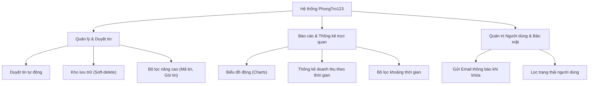

# Kế hoạch nâng cấp hệ thống quản trị chuyên nghiệp (PhongTro123)

Bản kế hoạch này đề xuất phương án chi tiết cho **10 tính năng nâng cao** nhằm nâng cấp đồ án của bạn thành một hệ thống SaaS thương mại hoàn thiện, tối ưu trải nghiệm người dùng và tự động hóa vận hành.

---

## 🗺️ Bản đồ nâng cấp tính năng

---

## 📋 Chi tiết giải pháp & Logic nghiệp vụ

### 1. Tự động duyệt tin đăng khi có nhiều người đăng tin (Auto-Moderation)
* **Ý tưởng**: Giảm tải cho Admin khi lưu lượng bài đăng quá lớn.
* **Giải pháp triển khai**:
  * Tạo một nút **Toggle Bật/Tắt chế độ duyệt tự động** trong cấu hình hệ thống của Admin.
  * Thiết lập bộ lọc thông minh: 
    * Chỉ tự động duyệt các tin từ các chủ trọ uy tín (có lịch sử > 5 tin đăng được duyệt thành công trước đó và không bị vi phạm).
    * Hoặc tự động duyệt các tin đăng mua gói dịch vụ cao cấp nhất (VIP Nổi bật) để tăng tốc dịch vụ.

### 2. Trạng thái tin đăng rõ ràng ở giao diện công khai (Public Status Label)
* **Ý tưởng**: Giúp người dùng biết bài đăng đã được duyệt hay chưa.
* **Giải pháp triển khai**:
  * Thêm một nhãn Text/Badge nhỏ (ví dụ: `✓ Đã kiểm duyệt` hoặc `⏳ Đang chờ duyệt`) trực tiếp bên cạnh tiêu đề tin đăng ở trang chi tiết bài đăng hoặc danh sách đề xuất.

### 3. Bộ lọc tin đăng theo gói dịch vụ (Filter by Package)
* **Ý tưởng**: Admin và chủ trọ dễ dàng quản lý chi phí dịch vụ.
* **Giải pháp triển khai**:
  * Thêm dropdown lọc theo gói tin (`VIP Nổi bật`, `VIP 1`, `VIP 2`, `VIP 3`, `Tin thường`) trên cả giao diện quản lý của Admin và Chủ trọ.
  * Backend sử dụng liên kết `Post -> Overview.bonus` để truy vấn chính xác theo gói.

### 4. Tìm kiếm bài đăng theo mã tin (Search by Post Code)
* **Ý tưởng**: Tìm kiếm chính xác tức thì thay vì gõ tiêu đề dài.
* **Giải pháp triển khai**:
  * Thêm ô nhập mã tin đăng (ví dụ: `#123456` hoặc mã UUID rút gọn) tại thanh tìm kiếm của Admin và Chủ trọ.
  * Tích hợp tìm kiếm theo `overview.code` hoặc `Post.id` trong Backend API.

### 5. Kho lưu trữ bài đăng ẩn - Soft-delete (Post Archiving)
* **Ý tưởng**: Không xóa vĩnh viễn bài đăng ra khỏi database (tránh mất mát số liệu tài chính), mà đưa vào kho lưu trữ riêng.
* **Giải pháp triển khai**:
  * **Loại bỏ nút Xóa vật lý**: Thay thế hành động xóa bằng nút **"Đưa vào kho lưu trữ"**.
  * **Database**: Thay đổi trạng thái bài đăng sang `status: "archived"` (hoặc thêm cột `isDeleted: true`).
  * **Giao diện Chủ trọ**: Bổ sung tab **"Kho tin lưu trữ"**. Tại đây chủ trọ có thể xem các tin cũ và bấm **"Khôi phục tin"** bất cứ lúc nào để gửi duyệt lại.

### 6. Nâng cấp Dashboard với Biểu đồ trực quan (Analytical Charts)
* **Ý tưởng**: Thay thế bảng số liệu nhàm chán bằng biểu đồ tương tác cao cấp.
* **Giải pháp triển khai**:
  * Sử dụng thư viện **Recharts** (nhẹ và tương thích hoàn hảo với React).
  * Vẽ biểu đồ đường (Line Chart) biểu diễn xu hướng đăng ký của người dùng mới.
  * Vẽ biểu đồ cột (Bar Chart) biểu diễn số lượng tin đăng mới được tạo ra theo khoảng thời gian.

### 7. Thống kê & Phân tích Doanh thu chuyên sâu (Revenue Dashboard)
* **Ý tưởng**: Thống kê nguồn tiền nạp và thanh toán gói dịch vụ.
* **Giải pháp triển khai**:
  * Thống kê dòng tiền từ bảng `Transactions` (doanh thu nạp tiền và phí đăng tin).
  * Hiển thị biểu đồ vùng (Area Chart) biểu diễn doanh thu tăng trưởng.
  * Cho phép tùy chọn thống kê nhanh theo **Tháng/Năm** thông qua dropdown lựa chọn.

### 8. Gửi Email thông báo khi khóa tài khoản (Automated Block Email)
* **Ý tưởng**: Thông báo rõ ràng lý do tài khoản bị khóa cho người dùng qua email cá nhân.
* **Giải pháp triển khai**:
  * Khi Admin click **"Khóa tài khoản"** ở trang quản trị, hệ thống sẽ hiện popup yêu cầu Admin nhập lý do khóa (ví dụ: *"Đăng tin rác lặp lại nhiều lần"*, *"Hình ảnh vi phạm thuần phong mỹ tục"*).
  * Server tích hợp **Nodemailer** tự động gửi một email HTML được thiết kế sang trọng đến địa chỉ Email đăng ký của user để thông báo chi tiết lý do và thời gian khóa.

### 9. Lọc người dùng theo trạng thái (Filter Users by Status)
* **Ý tưởng**: Quản lý danh sách thành viên hiệu quả hơn.
* **Giải pháp triển khai**:
  * Bổ sung dropdown lọc danh sách người dùng theo trạng thái (`Hoạt động`, `Bị khóa`) tại màn hình Quản lý người dùng của Admin.

### 10. Bộ lọc chọn khoảng thời gian tùy chỉnh (Date Range Filter)
* **Ý tưởng**: Phân tích dữ liệu trong một khoảng thời gian cụ thể (ví dụ: tuần trước, tháng trước).
* **Giải pháp triển khai**:
  * Tích hợp bộ chọn khoảng thời gian (Từ ngày... Đến ngày...) bằng thư viện Date Picker trên UI.
  * Backend lọc dữ liệu theo trường `createdAt` nằm giữa khoảng thời gian được chọn.

---

